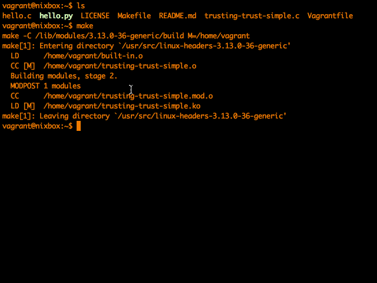

Simple Rootkit
=====================

</img>

A simple attack via kernel module, with highly detailed comments.

Here we'll compile a kernel module which intercepts every "read" system call, searches for a string and replaces it if it looks like the gcc compiler or the python interpreter. This is meant to demonstrate how a compromised system can build a malicious binary from perfectly safe source code.

For more information see: http://linux-poetry.com/blog/12/

Also check out: http://memset.wordpress.com/2010/12/03/syscall-hijacking-kernel-2-6-systems/

###Instructions

Install your kernel headers

    sudo apt-get install linux-headers-$(uname -r)

Run make

    cd simple-rootkit && make
  
Load the module

    sudo insmod simple-rootkit.ko
  
Compile any C or run any Python script and all instances of the string "World!" will now read as Mrrrgn.

    gcc hello.c -o hello
    ./hello
